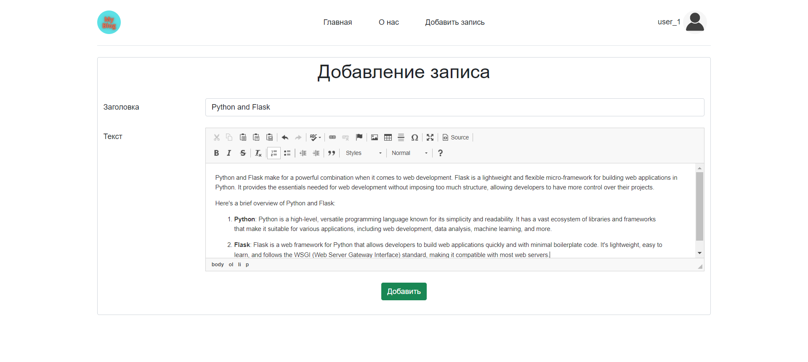
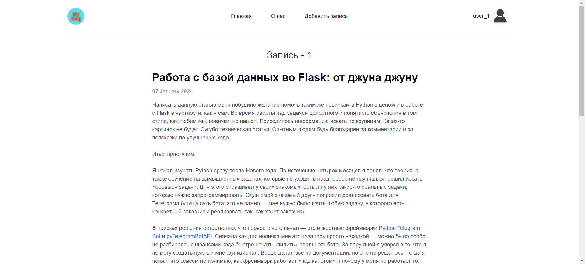
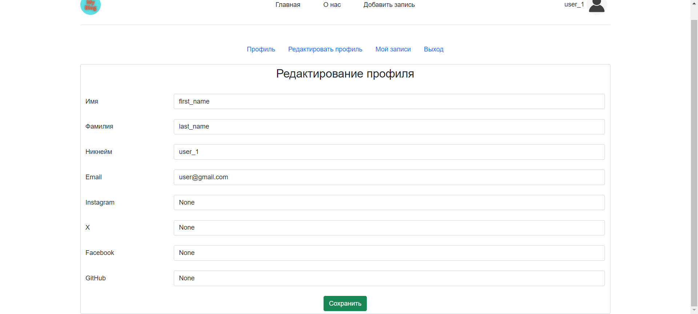
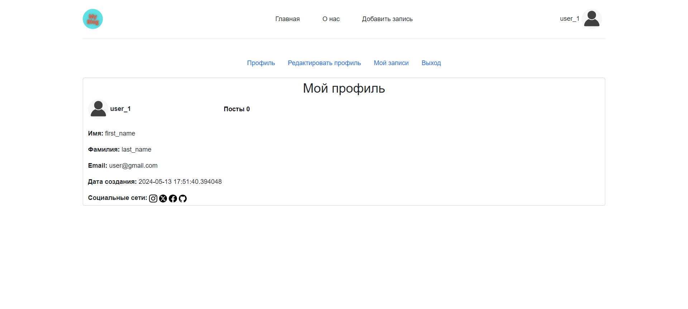

# Мини-блог с использованием Flask

Этот проект представляет собой мини-блог, разработанный с использованием Flask, SQLAlchemy и Flask-Login. Он позволяет пользователям регистрироваться, входить в систему, публиковать статьи, просматривать статьи других пользователей, редактировать свой профиль и многое другое.

## Функциональности

1. **Регистрация и аутентификация**: Пользователи могут зарегистрироваться, создав свой аккаунт, и входить в систему с помощью учетных данных.
   
2. **Создание статей**: Пользователи могут публиковать новые статьи.
    
3. **Редактирование и удаление статей**: Пользователи имеют возможность редактировать и удалять свои собственные статьи.
    
4. **Просмотр статей**: Пользователи могут просматривать статьи, опубликованные другими пользователями.
    
5. **Редактирование профиля**: Пользователи могут редактировать информацию в своем профиле, такую как имя, фамилия, электронная почта, социальные ссылки и т. д.
    
6. **Страница профиля**: Каждый пользователь имеет свою собственную страницу профиля, где отображается информация о нем и его опубликованные статьи.
   
7. **Панель управления статьями**: Пользователи могут увидеть список своих собственных статей на отдельной странице.

## Технические детали

Проект разработан с использованием следующих технологий и инструментов:

- **Flask**: Микрофреймворк Python для веб-приложений.
- **SQLAlchemy**: ORM (Объектно-реляционное отображение) для работы с базами данных в Python.
- **Flask-Login**: Расширение Flask для управления аутентификацией пользователей.
- **Flask-CKEditor**: Расширение Flask для интеграции редактора CKEditor.
- **Werkzeug**: Библиотека для обеспечения безопасности веб-приложений в Flask.
- **Pillow (PIL)**: Библиотека для обработки изображений в Python.

## Как использовать

1. Установите необходимые зависимости, указанные в `requirements.txt`.
2. Создайте базу данных с помощью команды `flask db init`, `flask db migrate`, `flask db upgrade`.
3. Запустите приложение с помощью команды `python app.py`.
4. Откройте браузер и перейдите на `http://localhost:5000/` для доступа к приложению.